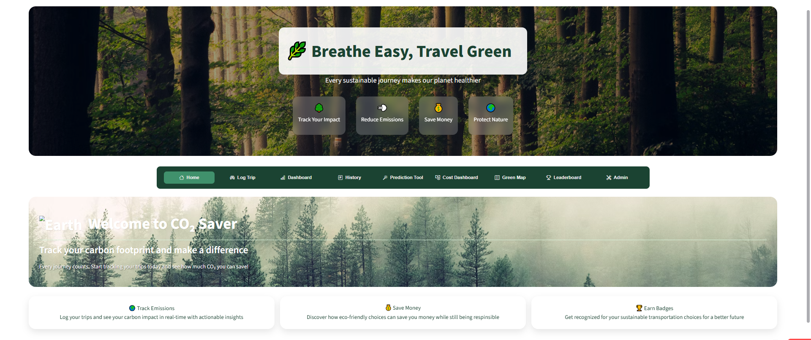
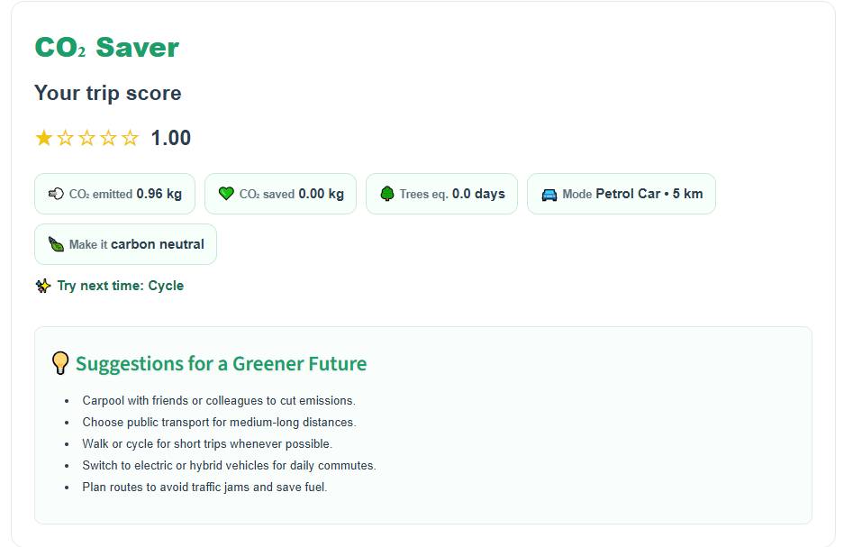

# 🌿 CO₂ Saver — Real-Time Carbon Intelligence & Emission Optimization Platform

CO₂ Saver is a sustainability-driven analytics platform that enables users to **track, predict, and reduce their transportation-based carbon footprint**.  
Unlike static carbon calculators, CO₂ Saver builds a **complete behavioral feedback loop**:

> **Measure → Predict → Motivate → Optimize**

---

## 🚀 Features

- ✅ **Trip-Based CO₂ Tracking** with IPCC-grade emission factors  
- 📄 **Instant Green Receipt** showing CO₂ emitted vs saved  
- 📊 **Live Analytics Dashboard** (emissions, savings, mode distribution)  
- 🏅 **Gamified Badges & Leaderboard Ranking System**  
- 🔮 **CO₂ Forecasting Engine (ML-based)** using trip frequency trends  
- 💰 **Cost Savings Calculator** (₹ saved vs petrol baseline)  
- 🗺️ **Green Route Suggestion Map** via geospatial routing  
- 🔧 **Admin Panel for Emission Coefficient Control**

---

## 🏗️ Tech Stack

| Layer | Technologies |
|--------|-------------|
| Frontend | Streamlit / Next.js |
| Backend | FastAPI / Flask |
| Database | Firestore / PostgreSQL |
| ML / Predictions | Scikit-Learn (RandomForest, XGBoost) |
| Analytics | Pandas / NumPy |
| Visualization | Matplotlib / Plotly |
| Geospatial | OpenRouteService API + Leaflet.js |
| Deployment | Streamlit Cloud / Vercel |

---

## 📌 How It Works (User Flow)

1. **Log Trip →** Choose Transport Mode + Distance + Occupancy  
2. **System Computes CO₂ Emission →** `CO₂ = distance × factor / occupancy`  
3. **Dashboard Updates in Real-Time →** Emission vs Savings  
4. **Badges & Leaderboard Trigger →** Rewards sustainable behavior  
5. **Prediction Engine Suggests Future Impact →** Change mode to improve rank

---

## 📱 UI Preview

# 🏡 Homepage 

 

# 🗺️ Trip Logging / Green Receipt 

 
